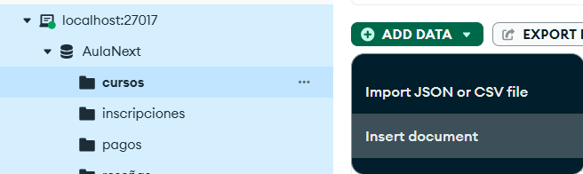
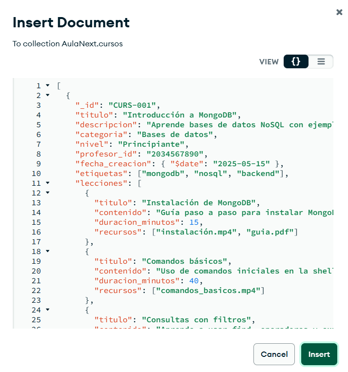

<p align="center">
  
</p>

# AulaNext

**AulaNext** es una plataforma de educación en línea diseñada para conectar estudiantes y profesores en un entorno digital accesible, organizado y moderno. El proyecto está pensado como una aplicación web educativa en la que los usuarios pueden registrarse, inscribirse en cursos y avanzar en su proceso de aprendizaje de manera estructurada.

AulaNext requiere el diseño de un modelo de base de datos integral que permita gestionar de forma eficiente cursos, lecciones, usuarios, profesores y sugerencias. Este modelo debe estar optimizado para responder a las necesidades del sistema y soportar la estructura completa de la plataforma.

## Modelo conceptual propuesto

<p align="center">
  
</p>

## Colecciones determinadas

### Usuarios

La colección usuarios almacena la información básica de las personas que interactúan con la plataforma. Aquí se registran tanto estudiantes como profesores, junto con sus datos personales, credenciales de acceso y rol dentro del sistema.

- **_id** (string): Cédula del usuario (identificador único).

- **nombre** (string): Nombre completo.

- **email** (string): Correo del usuario (único).

- **rol** (string): estudiante | profesor.

- **pais** (string): País de residencia.

- **fecha_registro** (string, YYYY-MM-DD): Fecha de alta en la plataforma.

- **intereses** (array): Temas de interés.

- **estado** (string): activo | inactivo | suspendido.

- **biografia** (string): Breve descripción del usuario.

📖 **Ejemplo**

```json
{
  "_id": "1023456789",
  "nombre": "Sebastián Delgado",
  "email": "sebas@gmail.com",
  "rol": "estudiante",
  "pais": "Colombia",
  "fecha_registro": "2025-06-01",
  "intereses": ["programación", "data science"],
  "estado": "activo",
  "biografia": "Estudiante apasionado por el backend y bases de datos."
}

```

### Cursos

Esta colección almacena la información de los cursos disponibles en la plataforma, incluyendo sus lecciones y recursos.

- **_id** (string): Identificador único del curso.

- **titulo** (string): Nombre del curso.

- **descripcion** (string): Breve resumen del contenido y objetivos del curso.

- **categoria** (string): Categoría principal del curso (ejemplo: "Bases de datos").

- **nivel** (string): Nivel de dificultad (Principiante | Intermedio | Avanzado).

- **profesor_id** (string): Referencia al ID del profesor que imparte el curso.

- **fecha_creacion** (string, YYYY-MM-DD): Fecha en que se creó el curso en la plataforma.

- **etiquetas** (array): Lista de palabras clave para clasificar y facilitar la búsqueda.

- **lecciones** (array[object]): Arreglo de objetos que representan las lecciones del curso, cada una con:

    - **titulo** (string): Nombre de la lección.

    - **contenido** (string): Descripción de lo que cubre la lección.

    - **duracion_minutos** (number): Duración estimada en minutos.

    - **recursos** (array): Archivos asociados a la lección (videos, PDFs, etc.).

📖 **Ejemplo**

```json
{
    "_id": "CURS-001",
    "titulo": "Introducción a MongoDB",
    "descripcion": "Aprende bases de datos NoSQL con ejemplos prácticos.",
    "categoria": "Bases de datos",
    "nivel": "Principiante",
    "profesor_id": "2034567890",
    "fecha_creacion": "2025-05-15",
    "etiquetas": ["mongodb", "nosql", "backend"],
    "lecciones": [
      {
        "titulo": "Instalación de MongoDB",
        "contenido": "Guía paso a paso para instalar MongoDB en tu PC.",
        "duracion_minutos": 15,
        "recursos": ["instalación.mp4", "guia.pdf"]
      },
      {
        "titulo": "Comandos básicos",
        "contenido": "Uso de comandos iniciales en la shell de MongoDB.",
        "duracion_minutos": 40,
        "recursos": ["comandos_basicos.mp4"]
      },
      {
        "titulo": "Consultas con filtros",
        "contenido": "Aprende a usar find, operadores y expresiones regulares.",
        "duracion_minutos": 25,
        "recursos": ["consultas.mp4", "ejercicios.pdf"]
      }
    ]
  }

```

### Inscripciones

En esta colección se realizan las inscripciones que realizan los estudiantes a los cursos deseados por realizar.

- **_id** (string): Identificador único de la inscripción.

- **usuario_id** (string): Referencia al ID único del usuario que se inscribe .

- **curso_id** (string): Referencia al ID único del curso inscrito.

- **fecha_inscripcion** (string, YYYY-MM-DD): Fecha en la que el usuario se inscribe al curso.

- **estado** (string): Estado de la inscripción → "activa" | "finalizada" | "cancelada".

- **progreso** (number): Porcentaje de avance del usuario en el curso (0–100).

- **calificacion** (number | null): Nota final del curso, en caso de estar finalizado. Puede ser null si aún no se ha calificado.

📖 **Ejemplo**

```json
{
    "_id": "INS-001",
    "usuario_id": "1023456789",
    "curso_id": "CURS-007",
    "fecha_inscripcion": "2025-01-15",
    "estado": "activa",
    "progreso": 40,
    "calificacion": null
  }

```

### Pagos

Colección donde se realizan los pagos de las inscripciones a los cursos hechas por lo estudiantes, los estuidantes que hayan hecho una inscripcion a un curso y hecho su pago, aparecerá en la colección de pagos

- **_id** (string): Identificador único del pago.

- **usuario_id** (string): ID del usuario que realizó el pago (relación con colección Usuarios).

- **curso_id** (string): ID del curso adquirido (relación con colección Cursos).

- **inscripcion_id** (string): ID de la inscripción vinculada al pago (relación con colección Inscripciones).

- **monto** (decimal): Valor total del pago realizado.

- **moneda** (string): Moneda utilizada en el pago (ejemplo: USD, EUR, COP).

- **metodo_pago** (string): Método utilizado para el pago. Ejemplo: tarjeta_credito | paypal | transferencia.

- **estado** (string): Estado del pago. Ejemplo: pendiente | completado | fallido.

- **fecha_pago** (date, ISO 8601): Fecha y hora en que se registró el pago.

- **detalles** (object): Información adicional del pago.

- **referencia_transaccion** (string): Código de referencia de la transacción.

- **proveedor** (string): Proveedor de pago utilizado (ejemplo: Stripe, PayPal).

📖 **Ejemplo**

```json
 {
    "_id": "payment-001",
    "usuario_id": "1023456789",
    "curso_id": "CURS-007",
    "inscripcion_id": "INS-001",
    "monto": 120.00,
    "moneda": "USD",
    "metodo_pago": "tarjeta_credito",
    "estado": "completado",
    "fecha_pago": new Date("2025-01-15T12:30:00Z"),
    "detalles": {
      "referencia_transaccion": "TXN10001",
      "proveedor": "Stripe"
    }
  }
```

### Reseñas

Esta colección almacena las reseñas que los usuarios dejan sobre los cursos en los que han participado. Contiene información sobre la calificación, comentarios y estado de la reseña.

- **_id** (string): Identificador único de la reseña.

- **usuario_id** (string): ID del usuario que realizó la reseña (relación con colección Usuarios).

- **curso_id** (string): ID del curso reseñado (relación con colección Cursos).

- **calificacion** (decimal): Puntuación otorgada al curso en una escala de 1 a 5 (puede incluir decimales).

- **comentario** (string): Opinión escrita por el usuario sobre el curso.

- **fecha_reseña** (date, ISO 8601): Fecha y hora en que se realizó la reseña.

- **estado** (string): Estado de la reseña. Ejemplo: publicada | pendiente | oculta.

📖 **Ejemplo**

```json
  {
    "_id": "RES-001",
    "usuario_id": "1023456789",
    "curso_id": "CURS-007",
    "calificacion": 4.8,
    "comentario": "El curso es excelente, muy bien estructurado y fácil de seguir.",
    "fecha_reseña": new Date("2025-08-10T14:20:00Z"),
    "estado": "publicada"
  },
```

## Como crear la base de datos en MongoDB

### Creacion de base de datos y colecciones

1. Primeramente se ejecuta el comando (ejecutarlo en la terminal usando "mongosh o la terminal de mongoshell en mongoCompass"):

```bash
use AulaNext
```

 este comando creará la base de datos **"AulaNext"**

2. Crear las colecciones

```javascript
db.createCollection("usuarios")

db.createCollection("cursos")

db.createCollection("reseñas")

db.createCollection("inscripciones")

db.createCollection("pagos")
```

Se ejecutan los comandos anteriores para la creación de las colecciones

3. Ejecutar las inserciones:

Se ejecutan los archivos JSON desde mongoCompass:

- Primeramente se abre mongoCompass

- Se conecta al servidor donde se creó la base de datos


- Dar click en la coleccion donde se van a insertar los datos y se elige la opción de insertar documentos o importar archivo JSON.


- Si se elige la opción de insertar documentos se copia y se pegan de los archivos JSON su contenido dando click a "insertar".


- si se elige la opción de importar archivo JSON, se abrirá el administrador de archivos donde se elige el archivo a insertar con sus registro.


## Consultas con expresiones regulares

En esta sección se presentan las consultas usando expresiones regulares utilizadas en cada una de las colecciones.

### Usuarios

#### Usuarios con nombres compuestos por dos palabras

```javascript
db.usuarios.find(
  { nombre: { $regex: "^[A-Za-zÁÉÍÓÚáéíóúÑñ]+\\s[A-Za-zÁÉÍÓÚáéíóúÑñ]+$", $options: "i" } },
  { nombre: 1, email: 1, rol: 1 }
)

```

**Función:**
Busca usuarios cuyo nombre completo esté compuesto por exactamente dos palabras, separadas por un espacio. La expresión regular asegura que ambas palabras tengan solo letras (incluyendo acentos y la ñ).

**Utilidad:**

- Permite validar o filtrar nombres completos en registros.

- Útil para análisis de datos donde se requiere distinguir entre nombres simples y compuestos.

#### Usuarios cuyo nombre comienza con "An" o "Andrea"

```jsx
db.usuarios.find(
  { nombre: { $regex: "^An(a|drea)", $options: "i" } },
  { nombre: 1, email: 1, rol: 1 }
)
```

**Función:**
Filtra los usuarios cuyo nombre empieza con “An” y continúa con “a” (como Ana) o “drea” (como Andrea). La búsqueda es insensible a mayúsculas/minúsculas (i).

**Utilidad:**

- Útil para campañas de marketing personalizadas o segmentación por nombre.

- Permite encontrar rápidamente coincidencias parciales de nombres sin requerir coincidencia exacta.

#### Usuarios cuyo email termina con ".edu"

```jsx
db.usuarios.find(
  { email: { $regex: ".edu$"} },
  { nombre: 1, email: 1, rol: 1 }
)

```

**Función:**
Encuentra todos los usuarios que tienen un correo electrónico de tipo educativo (termina en .edu).

**Utilidad:**

- Para identificar estudiantes o profesionales académicos.

#### Usuarios que tienen correos personales

```jsx
db.usuarios.find(
  { email: { $regex: "@(gmail|yahoo|hotmail|outlook)\\.com$" } },
  { nombre: 1, email: 1, rol: 1 } 
)

```

**Función:**
Filtra usuarios que utilizan correos personales de servicios populares como Gmail, Yahoo, Hotmail u Outlook.

**Utilidad:**

- Útil para segmentar usuarios no institucionales o no corporativos.

#### Usuarios que tienen . o _ en su correo electrónico

```jsx
db.usuarios.find(
  { email: { $regex: "^[A-Za-z0-9]*[._][A-Za-z0-9]*@.*$", $options: "i" } },
  { nombre: 1, email: 1, rol: 1 } 
)

```

**Función:**
Busca usuarios cuyo correo contenga un punto o guion bajo antes del símbolo @. Esto puede indicar nombres de usuario compuestos o más complejos.

**Utilidad:**

- Permite analizar patrones de creación de cuentas o detectar formatos inusuales.

- Útil para limpieza de datos o validación de emails.

#### Usuarios donde sus intereses terminan en "ción"

```jsx
db.usuarios.find(
  { intereses: { $regex: "ción$", $options: "i" } },
  { nombre: 1, email: 1, rol: 1, intereses: 1 }
)

```

**Función:**
Filtra usuarios cuyos intereses terminen en “ción”, por ejemplo “educación”, “programación” o “información”.

**Utilidad:**

- Útil para agrupar intereses que tengan un patrón lingüístico común.

<hr>

### Cursos

#### Cursos que en sus lecciones tienen temas introductorios

```jsx
db.cursos.find(
  {"lecciones.titulo": {$regex: "^Introducción"}},
  {"_id": 0, "titulo": 1, "descripcion": 1, "lecciones.titulo": 1}
)

```

**Función:**
Busca cursos donde alguna lección tenga un título que comience con “Introducción”.

**Utilidad:**

- Permite identificar cursos que comienzan con contenidos básicos o introductorios.

- Útil para guiar a estudiantes que necesiten empezar desde lo fundamental.

#### Cursos que contienen contenidos relacionados con JavaScript o JS

```jsx
db.cursos.find(
  { titulo: { $regex: "JavaScript|JS" } },
  { titulo: 1, descripcion: 1 }
)

```

**Función:**
Filtra cursos cuyo título mencione JavaScript o JS, sin importar mayúsculas/minúsculas.

**Utilidad:**

- Útil para encontrar cursos de programación en JavaScript rápidamente.

- Facilita recomendaciones o búsqueda por temática tecnológica específica.

#### Cursos que tienen lecciones con recursos en PDF

```jsx
db.cursos.find(
  { "lecciones.recursos": { $regex: "\.pdf$" } },
  { titulo: 1, contenido: 1, "lecciones.recursos": 1 }
)

```

**Función:**
Encuentra cursos que incluyan archivos PDF como recursos dentro de sus lecciones.

**Utilidad:**

- Permite identificar cursos con material descargable para estudio offline.

#### Cursos que tienen lecciones con recursos en MP4

```jsx
db.cursos.find(
  { "lecciones.recursos": { $regex: "\.mp4$" } },
  { titulo: 1, contenido: 1, "lecciones.recursos": 1 }
)

```

**Función:**
Filtra cursos que tengan videos en formato MP4 dentro de sus lecciones.

**Utilidad:**

- Ideal para localizar cursos con contenido audiovisual.

- Permite segmentar cursos según el tipo de material de aprendizaje que ofrecen.

#### Cursos que tienen lecciones con recursos en CSV

```jsx
db.cursos.find(
  { "lecciones.recursos": { $regex: "\.csv$" } },
  { titulo: 1, contenido: 1, "lecciones.recursos": 1 }
)

```

**Función:**
Encuentra cursos que incluyen archivos CSV como recursos en sus lecciones.

**Utilidad:**

- Útil para cursos relacionados con análisis de datos o manejo de hojas de cálculo.

- Facilita la descarga de datasets de práctica para los estudiantes.

#### Cursos donde su categoría contenga la palabra “datos”

```jsx
db.cursos.find(
  { categoria: { $regex: "datos", $options: "i"} },
  { titulo: 1, categoria: 1 }
)

```

**Función:**
Filtra cursos cuya categoría contenga la palabra “datos”, sin importar mayúsculas/minúsculas.

Utilidad:

- Permite identificar rápidamente cursos relacionados con ciencia de datos, análisis de datos o bases de datos.

- Útil para segmentar cursos según áreas temáticas específicas.

#### Cursos con exactamente 3 palabras en su título

```jsx
db.cursos.find(
  {titulo: { $regex: "^[A-Za-z]*\\s[A-Za-z]*\\s[A-Za-z]*$", $options: "i" }},
  { titulo: 1 }
)

```

**Función:**
Busca cursos cuyo título tenga exactamente tres palabras, sin importar mayúsculas/minúsculas.

**Utilidad:**

- Útil para análisis de nombres de cursos y estandarización de títulos.

- Permite filtrar cursos con títulos cortos y concisos.

### Inscripciones

#### Inscripciones a cursos de ciencias de datos o bases de datos

```jsx
db.inscripciones.find(
  { curso_id: { $regex: "CURS-(001|003|007|006)" } },
  { usuario_id: 1, curso_id: 1, fecha_inscripcion: 1, estado: 1 }
)

```

**Función:**
Busca inscripciones a cursos específicos cuyos IDs coinciden con CURS-001, CURS-003, CURS-007 o CURS-006.

**Utilidad:**

- Permite filtrar inscripciones a cursos de un área específica, como ciencia de datos o bases de datos.

#### Inscripciones que están activas o pendientes

```jsx
db.inscripciones.find(
  { estado: { $regex: "activa|pendiente", $options: "i" } },
  { progreso: 0, estado: 0, calificacion: 0 }
)

```

**Función:**
Filtra las inscripciones cuyo estado sea “activa” o “pendiente”, ignorando mayúsculas/minúsculas.

**Utilidad:**

- Permite identificar estudiantes que aún no han completado el curso o que están actualmente cursando.

- Útil para enviar notificaciones, seguimiento de progreso o recordatorios de inscripción.

#### Inscripciones a cursos cuyo ID termina en un número par

```jsx
db.inscripciones.find(
  { curso_id: { $regex: "\\d[02468]$" } },
  { usuario_id: 1, curso_id: 1, fecha_inscripcion: 1, estado: 1 }
)

```

**Función:**
Busca inscripciones a cursos cuyos IDs terminan en números pares (0, 2, 4, 6, 8).

**Utilidad:**

- Útil para análisis estadístico o segmentación basada en patrones de ID.

#### Inscripciones a cursos cuyo ID termina en un número impar

```jsx
db.inscripciones.find(
  { curso_id: { $regex: "\\d[13579]$" } },
  { usuario_id: 1, curso_id: 1, fecha_inscripcion: 1, estado: 1 }
)

```

**Función:**
Filtra inscripciones a cursos cuyos IDs terminan en números impares (1, 3, 5, 7, 9).

**Utilidad:**

- Complementa la segmentación por número de ID par/impar.


### Pagos

#### Pagos realizados por usuarios cuyo ID termina en "89"

```jsx
db.pagos.find(
  { usuario_id: { $regex: "89$" } },
  { usuario_id: 1, monto: 1, fecha_pago: 1, estado: 1 }
)

```

**Función:**
Filtra los pagos realizados por usuarios cuyos IDs terminan en “89”.

**Utilidad:**

- Permite analizar pagos de un grupo específico de usuarios.

#### Pagos con referencias de transacción que comienzan con "TXN" seguido de 5 dígitos

```jsx
db.pagos.find(
  { "detalles.referencia_transaccion": { $regex: "^TXN\\d{5}$" } },
  { usuario_id: 1, monto: 1, fecha_pago: 1, "detalles.referencia_transaccion": 1 }
)

```

**Función:**
Busca pagos cuya referencia de transacción siga el formato TXN12345 (TXN + 5 dígitos).

**Utilidad:**

- Permite validar el formato de referencias de transacción.

- Útil para conciliaciones, reportes financieros o detección de errores en registros.

#### Pagos que están pendientes o completados

```jsx
db.pagos.find(
  { estado: { $regex: "completado|pendiente", $options: "i" } },
  { usuario_id: 1, monto: 1, fecha_pago: 1, estado: 1 }
)

```

**Función:**
Filtra pagos según su estado, considerando “completado” o “pendiente”, sin importar mayúsculas/minúsculas.

**Utilidad:**

- Permite gestionar pagos pendientes y confirmar los pagos completados.

- Útil para control de flujo de caja y seguimiento financiero de usuarios.

#### Pagos realizados por proveedores específicos como "Stripe" o "PayPal"

```jsx
db.pagos.find(
  { "detalles.proveedor": { $regex: "^(Stripe|PayPal)$", $options: "i" } },
  { usuario_id: 1, monto: 1, fecha_pago: 1, "detalles.proveedor": 1 }
)

```

**Función:**
Filtra pagos que fueron procesados por proveedores específicos como Stripe o PayPal, sin importar mayúsculas/minúsculas.

**Utilidad:**

- Permite analizar o comparar transacciones según el proveedor de pago.


### Reseñas

#### Reseñas que contienen la palabra "excelente" o "recomendado"

```jsx
db.reseñas.find(
  { comentario: { $regex: "(excelente|recomendado)", $options: "i" } },
  { usuario_id: 1, curso_id: 1, comentario: 1 }
)

```

**Función:**
Filtra reseñas cuyo comentario incluya las palabras “excelente” o “recomendado”, sin importar mayúsculas/minúsculas.

**Utilidad:**

- Permite identificar comentarios positivos de los usuarios.

- Útil para análisis de satisfacción, promoción de cursos o selección de testimonios destacados.

#### Reseñas de usuarios que contengan la palabra "mejorar"

```jsx
db.reseñas.find(
  { comentario: { $regex: "mejorar", $options: "i" } },
  { usuario_id: 1, curso_id: 1, comentario: 1 }
)

```

**Función:**
Filtra reseñas que mencionen la palabra “mejorar”, ignorando mayúsculas/minúsculas.

**Utilidad:**

- Permite detectar sugerencias o críticas constructivas de los usuarios.

- Útil para mejorar cursos, contenido y experiencia de aprendizaje.

#### Reseñas de usuarios que opinan sobre los cursos del 1 al 5

```jsx
db.reseñas.find(
  { curso_id: { $regex: "^CURS-00[1-5]$" } }
)

```

**Función:**
Filtra reseñas correspondientes a los cursos con IDs CURS-001 hasta CURS-005.

**Utilidad:**

- Permite analizar la retroalimentación de un conjunto específico de cursos.

- Útil para comparar opiniones de cursos de una misma categoría o rango.

#### Reseñas que terminan con un punto final

```jsx
db.reseñas.find(
  { comentario: { $regex: "\\.$" } },
  { usuario_id: 1, curso_id: 1, comentario: 1 }
)

```

**Función:**
Filtra reseñas cuyo comentario termina con un punto final (.).

**Utilidad:**

- Útil para análisis de estilo de escritura o consistencia en los comentarios.

- Puede ayudar a detectar reseñas completas frente a comentarios incompletos.


